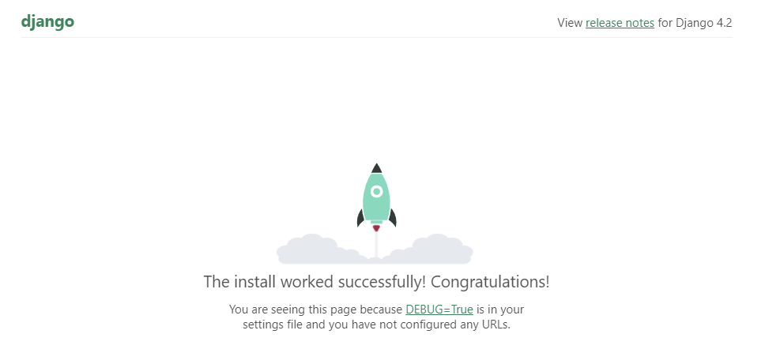

# backend django integration

### 1. 가상환경 생성
.git파일이 존재하는 폴더의 바깥쪽에 가상환경을 생성한다.
```cmd
python -m venv <가상환경이름>
```
### 가상환경 불러오기
vscode화면에서 ctrl + shift + p 를 누르고 파이썬 인터프리터 로컬에서 불러오기를 선택한다. 이후 가상환경을 불러오면 되는데 한번 불러오면 다음에는 터미널에서 cmd를 켜기만 해도 적용이 된다.
가상환경이름 / Scripts / python.exe 를 클릭
### 2. pip install
python의 라이브러리들을 로컬 컴퓨터에 설치를 하는데 requirements.txt파일을 이용한다.
```cmd
pip install -r requirements.txt 
``` 
### 3. 서버실행
```python
#옆에 (venv)라는 표시가 뜰 때 해당 명령어를 cmd에서 실행하면 server를 간단하게 실행할 수 있다.
python manage.py runserver
```

### 4. admin
admin페이지를 생성했지만 아직 꾸미지는 않음
admin계정 : admin, 1234
>**admin페이지 api : localhost:8000/admin**

### 5. swagger api
>**localhost:8000/swagger**
api를 테스트할 수 있다. 서버를 실행한 후에 확인할 수 있다.

>**localhost:8000/redoc**
문서로 정리된 api들을 확인할 수 있다. 서버를 실행한 후에 확인할 수 있다.